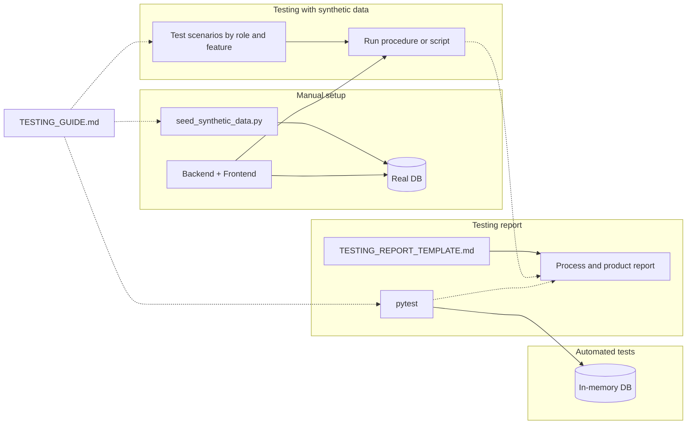

# AKTU Autonomy Portal — Testing and Validation Plan (Comprehensive)

**Document purpose:** This document consolidates the full plan for testing and validation using synthetic data, automated tests, and detailed reporting. It is intended for review by project stakeholders and implementers.

**Status:** Plan (for review).  
**Last updated:** As of plan date.

---

## Table of contents

1. [Goals and scope](#1-goals-and-scope)
2. [Deliverables summary](#2-deliverables-summary)
3. [Synthetic data seed script](#3-synthetic-data-seed-script)
4. [Synthetic data: suitable elements and known issues](#4-synthetic-data-suitable-elements-and-known-issues)
5. [Testing guide structure](#5-testing-guide-structure)
6. [Test scenarios (synthetic data)](#6-test-scenarios-synthetic-data)
7. [Detailed testing report (process and product)](#7-detailed-testing-report-process-and-product)
8. [Out of scope](#8-out-of-scope)
9. [End-to-end flow](#9-end-to-end-flow)
10. [Review checklist](#10-review-checklist)

---

## 1. Goals and scope

| Goal | Description |
|------|-------------|
| **Synthetic data** | Run a seed script against the real app database (local or Colab) to create 2 institutions, one user per role (6 users) with a known password, and 2–3 applications in different workflow statuses. The script **verifies** that data was created suitably and effectively (counts and role/status coverage) and exits with code 1 if not. |
| **Automated tests** | Document how to run the existing pytest suite, frontend lint/build/e2e, and CI so testers and CI use the same commands. |
| **Testing with synthetic data** | Define a structured test procedure (scenarios by role and by feature) so the software is tested **suitably** using the seeded data; document it in the testing guide and optionally support it with a script that runs API checks against the seeded backend. |
| **Detailed testing report** | Provide a **process** report (how testing was done, environment, seed run, dates, tester) and a **product** report (test cases, expected vs actual, pass/fail, summary) via a report template and, optionally, a report generator. |

**Scope:** No changes to existing pytest test code or CI logic. New artifacts: seed script, testing guide (with test scenarios), testing report template, and optional tooling (synthetic-data test script and/or report generator).

---

## 2. Deliverables summary

| Deliverable | Purpose |
|-------------|---------|
| `backend/scripts/seed_synthetic_data.py` | Seeds the real DB with institutions, users (all roles), and applications; runs post-seed verification; prints user table and summary. |
| `docs/TESTING_GUIDE.md` | Single guide: prerequisites, run app, synthetic data (how to run seed, user table, verification, known issues), manual testing (Swagger + frontend), test scenarios with synthetic data, automated tests (pytest, frontend, CI), quick checklist. |
| `docs/TESTING_REPORT_TEMPLATE.md` | Markdown template with Process and Product sections for detailed testing reports. |
| Optional: `backend/scripts/run_synthetic_data_tests.py` (or similar) | Runs HTTP checks against a running backend with seed loaded; records pass/fail per scenario; can feed into report. |
| Optional: Report generator | Runs pytest and/or synthetic-data script and embeds results into the report template. |

---

## 3. Synthetic data seed script

### 3.1 Purpose

- Seed the **real** app database (same URL as the running app), not the in-memory DB used by pytest.
- Run once after `alembic upgrade head` (e.g. on a fresh or wiped DB).
- Used for manual testing and for any scripted tests that run against the seeded backend.

### 3.2 Data to create

| Entity | Count | Details |
|--------|-------|---------|
| **Institutions** | 2 | e.g. "Synthetic College A" and "Synthetic College B"; unique `code`, address, district, contact_email, contact_phone. |
| **Users** | 6 | One per role: INSTITUTION (2, one per institution), DEALING_HAND, REGISTRAR, COMMITTEE, AUTHORITY, ACCOUNTS. Shared password (e.g. `Test@123`), hashed via app’s `hash_password`. INSTITUTION users have `institution_id` set; others null. |
| **Applications** | 2–3 | Attached to seeded institutions; statuses such as DRAFT, SUBMITTED_ONLINE or HARDCOPY_RECEIVED, and optionally UNDER_SCRUTINY or SCRUTINY_CLEARED. Required fields: `institution_id`, `status`, `requested_from_year`, `programmes_json`, `ugc_policy_mode`, `ugc_approval_recorded`. |

### 3.3 Implementation notes

- Use the app’s async session and config (same DB as the app).
- **Environment:** Set `ENV=dev` (or leave unset), set `JWT_SECRET` (required), optionally `AKTU_DB_PATH`.
- **Run command (from repo root):** `PYTHONPATH=backend python backend/scripts/seed_synthetic_data.py` (or from `backend/`: `python -m scripts.seed_synthetic_data`).
- **Idempotency:** Either skip if key seed users already exist (e.g. by fixed email pattern like `seed_*@synthetic.local`) or document "run once on empty DB" and how to reset.

### 3.4 Output

- Print a **table of seeded users** (email, role, password) for the testing guide.
- Print a **short summary** (e.g. "Institutions: 2, Users: 6, Applications: 3") and the list of application statuses created.

### 3.5 Verification (suitability and effectiveness)

- **Post-seed self-check (in script):** After committing, re-query and verify:
  1. Exactly 2 institutions.
  2. Exactly 6 users with one per role (INSTITUTION x2, DEALING_HAND, REGISTRAR, COMMITTEE, AUTHORITY, ACCOUNTS).
  3. At least 2 and at most 5 applications with statuses spanning different workflow stages (e.g. at least one DRAFT, one beyond DRAFT such as SUBMITTED_ONLINE or HARDCOPY_RECEIVED, and optionally one further along).
- If any check fails: print expected vs found and **exit with code 1**.
- **Printed report:** Summary line per entity type and list of application statuses so a human can confirm the seed is effective for manual workflow testing.

---

## 4. Synthetic data: suitable elements and known issues

### 4.1 Additional suitable elements (for effective testing and validation)

| Element | Guidance |
|---------|----------|
| **Application payload variety** | Seed at least one application with minimal valid `programmes_json` (e.g. `[]` or minimal structure) and one with fuller structure; vary `requested_from_year` (e.g. current and previous year) and `ugc_policy_mode` / `ugc_approval_recorded` in line with workflow rules (e.g. for decision issuance). |
| **Application–institution–user mapping** | Document which application(s) each institution user can see (by `institution_id`). Ensure at least one application per institution so both INSTITUTION users have data to list and transition. |
| **Status coverage for transitions** | Seed applications so **valid next transitions** are testable: e.g. one in DRAFT (submit online), one in HARDCOPY_RECEIVED (Dealing Hand → UNDER_SCRUTINY or SCRUTINY_CLEARED), optionally SCRUTINY_CLEARED (Registrar/Authority → committee), MEETING_SCHEDULED or MOM_FINALIZED if committee/Authority flows are in scope. Avoid seeding only statuses with no allowed transition for the seeded roles. |
| **Related entities (optional)** | Where the API supports it, consider seeding minimal related data (e.g. one document per type for an application, or committee/meeting records for an application in COMMITTEE_CONSTITUTED or MEETING_SCHEDULED). If not seeded, the testing guide must state that document-upload and committee/meeting scenarios require manual steps. |
| **Negative-test scenarios** | Include 1–2 negative scenarios in the testing guide (e.g. Institution user cannot transition another institution’s application; Authority cannot move DRAFT → DECISION_ISSUED; invalid transition returns 4xx) to validate RBAC and workflow guards. |
| **Consistency with workflow** | Ensure seeded statuses and `ugc_*` fields are consistent with `workflow.py` (e.g. `can_issue_granted`) so decision-issuance tests are meaningful. |

### 4.2 Known issues and considerations (to document or handle)

| Issue | Action |
|-------|--------|
| **Idempotency** | Re-running the seed on a non-empty DB can create duplicate users/institutions. Either document "run once on empty DB" and how to reset (e.g. delete DB file and run `alembic upgrade head`), or implement skip-if-exists (e.g. by fixed email prefix) and document the behaviour. |
| **Never use in production** | Document that the seed script and seeded credentials are for dev/test only. Add a guard or warning in the script if `ENV=prod` (or equivalent) is set. State in the guide that production must never use seeded data or the shared password. |
| **Weak password** | The shared password (e.g. `Test@123`) is intentionally weak for convenience. Document this and that production users must use strong, unique passwords. |
| **Schema and seed drift** | After model or migration changes, the seed script may break or produce invalid data. Document that the seed should be updated when models or workflow change; post-seed self-check helps catch obvious mismatches. |
| **Institution visibility** | Institution users see only their institution’s applications. The guide must state which seeded user sees which application(s) (e.g. "College A user sees app ids X, Y; College B sees app Z"). |
| **Missing files** | Seeded applications typically have no real file uploads. Document that document-upload scenarios may require manual upload in Swagger/frontend, or that optional seed of document metadata (without file content) is acceptable for list/detail tests. |
| **Failure capture** | When a scenario fails, testers should record: step number, HTTP status code, response body or error message. Add these fields to the testing report template (product section) and reference in the scenario procedure. |
| **Clean state for re-testing** | Document how to obtain a clean DB (e.g. remove `aktu_autonomy.db`, run `alembic upgrade head`, then run seed again). Mention Colab vs local (e.g. DB path on Drive vs local path). |

---

## 5. Testing guide structure

The testing guide (`docs/TESTING_GUIDE.md`) will be titled **AKTU Autonomy Portal — Testing Guide** and include:

| Section | Content |
|---------|---------|
| 1. Overview | For developers/testers; manual (Swagger + frontend) and automated (pytest, frontend, CI) testing. |
| 2. Prerequisites | Python 3.10+, Node 18+, backend `.env` (e.g. JWT_SECRET), frontend `.env.local`, Colab tokens if using Colab. Reference README and .env.example. |
| 3. Running the application | Colab vs local backend; frontend; where data lives (Drive vs local). |
| 4. Synthetic data for manual testing | What the seed creates; how to run the seed (command + ENV/JWT_SECRET); **table of seeded users** (email, role, shared password); **application–institution mapping** (which user sees which applications); **verifying seed data** (script self-check, optional manual check via Swagger); **known issues** (idempotency, production, password, schema drift, missing uploads, clean state). Note: pytest uses in-memory DB; no seed in CI. |
| 5. Manual testing — API (Swagger) | Login with seeded users or register; Authorize; smoke checks (health, list/create applications). |
| 6. Manual testing — Frontend | Use seeded users to drive dashboard and application workflows. |
| 7. Automated tests | Backend: `ENV=test`, `JWT_SECRET=test-secret`, `pytest`; list test modules (e.g. test_auth_rbac, test_application_workflow, test_document_uploads, test_committee_office_order, test_meeting_notice, test_mom, test_decision, test_health, test_config, test_security, test_db_basic, test_workflow_transitions); optional ruff/black. Frontend: lint, build; optional Playwright e2e. CI: link to .github/workflows/ci.yml. |
| 8. Quick test checklist | Backend live, (optional) seed loaded, login as seeded user, run pytest, run frontend build. |

Plus a dedicated subsection: **Testing the software with synthetic data (suitably)** — see [Section 6](#6-test-scenarios-synthetic-data).

---

## 6. Test scenarios (synthetic data)

A structured test procedure will be defined so the product is tested suitably using the seeded data.

### 6.1 By role

For each seeded role, 2–4 concrete test scenarios with steps, expected outcome, and pass/fail to record:

| Role | Example scenarios |
|------|-------------------|
| **Institution** | Log in; list my applications; create draft; submit online (DRAFT → SUBMITTED_ONLINE). |
| **Dealing Hand** | Log in; list applications; transition HARDCOPY_RECEIVED → UNDER_SCRUTINY (or SCRUTINY_CLEARED). |
| **Registrar** | Log in; constitute committee for an application in SCRUTINY_CLEARED. |
| **Committee** | Log in; add meeting; generate MoM draft for an application in MEETING_SCHEDULED. |
| **Authority** | Log in; issue decision for an application in MOM_FINALIZED. |
| **Accounts** | Log in; list applications / perform role-specific actions as per product scope. |

Each scenario: login with seeded user, call which endpoint or UI action, expected outcome, pass/fail.

### 6.2 By feature/area

| Area | What to test (reference seeded data) |
|------|--------------------------------------|
| Health | `GET /api/health`, `GET /api/health/live`. |
| Auth | Login/register; use seeded credentials. |
| Applications CRUD | List, create, get by id; use seeded application ids and institution users. |
| Workflow transitions | Use seeded applications and their statuses; only valid transitions (e.g. HARDCOPY_RECEIVED → UNDER_SCRUTINY by Dealing Hand). |
| Documents | Upload/list; note seeded apps may have no documents—manual upload or optional metadata seed. |
| Committee / Meeting / MoM / Decision | If in scope; use applications in appropriate status (e.g. COMMITTEE_CONSTITUTED, MEETING_SCHEDULED, MOM_FINALIZED). |

### 6.3 Negative scenarios

Include 1–2 explicit negative cases:

- Institution user cannot transition another institution’s application (expect 403 or 404 as appropriate).
- Authority cannot move DRAFT → DECISION_ISSUED (invalid transition; expect 4xx).
- Wrong role for a transition returns 403.

### 6.4 Failure capture

- On failure, record: **step number**, **HTTP status code**, **response body or error message**.
- These fields will be in the testing report template (product section) and referenced in the scenario procedure.

### 6.5 Optional automation

A small script (e.g. `backend/scripts/run_synthetic_data_tests.py`) that, against a running backend with seed loaded:

- Performs HTTP calls (login as each role, GET applications, optional transition).
- Records pass/fail per scenario.
- Writes a machine-readable summary (e.g. JSON or a section of the report) to support generating the product part of the report automatically.

---

## 7. Detailed testing report (process and product)

### 7.1 Purpose

Enable generation of a **detailed testing report** covering:

- **Process:** How testing was carried out (environment, seed run, execution method, duration, tester).
- **Product:** What was tested and with what results (scenarios, expected vs actual, pass/fail, summary, defects).

### 7.2 Report template (`docs/TESTING_REPORT_TEMPLATE.md`)

**Process report (sections/fields):**

- Report date  
- Tester name  
- Environment: OS, Python version, Node version, DB path (or "in-memory" for pytest)  
- Seed data: whether used; if yes, seed command and script output summary  
- Test execution: manual vs automated; if automated, command (e.g. `pytest` or script name); if manual, reference to TESTING_GUIDE sections  
- Duration  
- Notes  

**Product report (sections):**

- Test scope (e.g. "API with synthetic data", "pytest suite", "frontend build")  
- List of test scenarios/cases: scenario id, description, expected result, actual result, pass/fail  
- On failure: step number, HTTP status code, response body or error message (as in [Section 6.4](#64-failure-capture))  
- Summary: total passed, failed, skipped; optional coverage or area summary  
- Defects or observations (optional table: id, description, severity)  

### 7.3 Usage

- Testers run the test procedure (manual and/or automated).
- Fill the template or run a report generator (if implemented).
- Save the report (e.g. `docs/reports/TESTING_REPORT_YYYY-MM-DD.md`).
- Template should be copy-paste friendly and reference the testing guide for scenario details.

### 7.4 Optional report generator

- If the optional "run synthetic data tests" script is implemented, it can append a **product** section to a report file (or output JSON) with scenario names and pass/fail; the tester fills the **process** section and merges.
- Alternatively, a script that runs pytest, captures stdout/exit code, and embeds a summary into the template (e.g. "Backend pytest: 42 passed, 0 failed") for the product section.

---

## 8. Out of scope

- No new pytest tests or changes to existing test code (only optional script that runs against the seeded backend, outside pytest).
- No changes to `.github/workflows/ci.yml` logic (only documented in the guide).
- No seed data for the pytest in-memory DB (tests continue to create their own data per test).

---

## 9. End-to-end flow

**Sequence:** Run the seed → verify with script self-check → test the software using the defined scenarios (manual and/or optional script) → run the automated suite (pytest + frontend) → produce a detailed testing report (process + product) using the template and optional generator.

---

## 10. Review checklist

Use this checklist when reviewing the plan or when verifying implementation.

- [ ] **Seed script:** Creates 2 institutions, 6 users (one per role), 2–3 applications with varied statuses; uses app’s session/config; runs post-seed verification and exits 1 on failure; prints user table and summary.
- [ ] **Suitable elements:** Application payload variety, application–institution mapping documented, status coverage for transitions, optional related entities, negative scenarios in guide, workflow consistency.
- [ ] **Known issues:** Idempotency, production guard, weak password, schema drift, institution visibility, missing files, failure capture fields, clean-state instructions—all documented in guide and/or script.
- [ ] **Testing guide:** Contains all sections in [Section 5](#5-testing-guide-structure) and the test scenarios in [Section 6](#6-test-scenarios-synthetic-data).
- [ ] **Report template:** Contains Process and Product sections with fields listed in [Section 7.2](#72-report-template-docstesting_report_templatemd).
- [ ] **Deliverables:** Seed script, TESTING_GUIDE.md, TESTING_REPORT_TEMPLATE.md present; optional scripts noted where applicable.

---

*End of document.*
